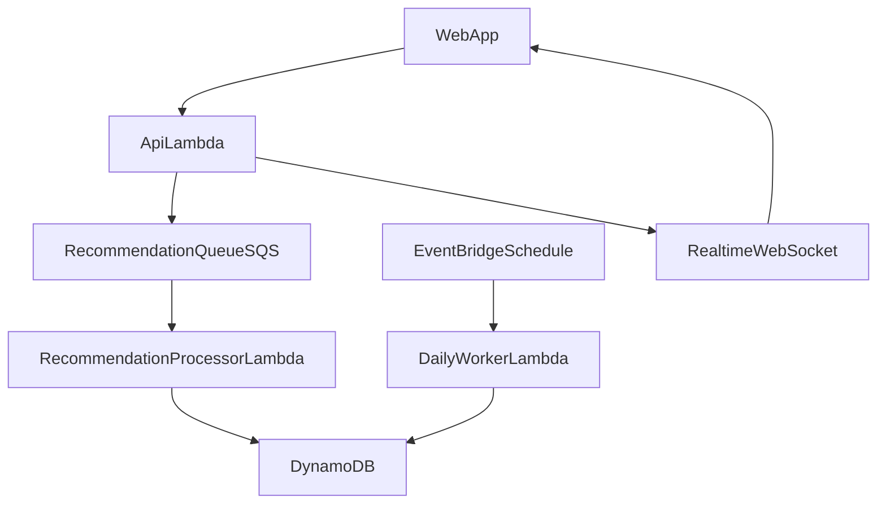

# Worker Split and Async Processing Plan

## Target Architecture

## Phase 1: Introduce Explicit Runtime Roles (No Behavior Break)

- Keep current behavior running while creating clear boundaries:
  - `daily-worker` = scheduled tasks only.
  - `recommendation-processor` = async recommendation job consumer.
- Update naming and docs to reflect the split.
- Maintain existing recommendation queue storage in Dynamo temporarily as rollback path.

Primary files:

- [infra/terraform/modules/worker_lambda/main.tf](/Users/frank/Code/duckbite/badgers-investments/infra/terraform/modules/worker_lambda/main.tf)
- [infra/terraform/modules/worker_lambda/variables.tf](/Users/frank/Code/duckbite/badgers-investments/infra/terraform/modules/worker_lambda/variables.tf)
- [infra/terraform/envs/prod/main.tf](/Users/frank/Code/duckbite/badgers-investments/infra/terraform/envs/prod/main.tf)
- [infra/terraform/envs/prod/outputs.tf](/Users/frank/Code/duckbite/badgers-investments/infra/terraform/envs/prod/outputs.tf)
- [docs/architecture.md](/Users/frank/Code/duckbite/badgers-investments/docs/architecture.md)
- [docs/project-structure.md](/Users/frank/Code/duckbite/badgers-investments/docs/project-structure.md)

## Phase 2: Add SQS + Lambda Event Source for Recommendations (DB-165 Core)

- Provision dedicated recommendation SQS queue + DLQ.
- Configure Lambda event source mapping with low-traffic-friendly settings:
  - `batch_size = 1`
  - `maximum_batching_window_in_seconds = 0`
  - proper visibility timeout aligned to processor max execution.
- Add CloudWatch alarms for queue age/backlog/DLQ.
- Keep EventBridge daily worker unchanged.

Primary files:

- [infra/terraform/envs/prod/main.tf](/Users/frank/Code/duckbite/badgers-investments/infra/terraform/envs/prod/main.tf)
- [infra/terraform/envs/prod/variables.tf](/Users/frank/Code/duckbite/badgers-investments/infra/terraform/envs/prod/variables.tf)
- [infra/terraform/envs/prod/terraform.tfvars.example](/Users/frank/Code/duckbite/badgers-investments/infra/terraform/envs/prod/terraform.tfvars.example)

## Phase 3: Wire Processor Lambda to Existing Recommendation Service Logic

- Add recommendation processor lambda handler that reuses existing service methods (`instantiateRecommendationRunService`, `completeQueuedRecommendationJob`) to avoid logic duplication.
- API enqueue path additionally dispatches the processor via SQS payload (`userId`, `portfolioId`, `runId`, `enqueuedAtIso`).
- Preserve idempotency using existing `runStatus !== PROCESSING` guard.

Primary files:

- [services/api/src/modules/recommendations/recommendation-run-service.ts](/Users/frank/Code/duckbite/badgers-investments/services/api/src/modules/recommendations/recommendation-run-service.ts)
- [services/api/src/modules/recommendations/instantiate-recommendation-run-service.ts](/Users/frank/Code/duckbite/badgers-investments/services/api/src/modules/recommendations/instantiate-recommendation-run-service.ts)
- [services/api/src/scripts/process-recommendation-queue.ts](/Users/frank/Code/duckbite/badgers-investments/services/api/src/scripts/process-recommendation-queue.ts)
- [workers/worker/src/lambda-handler.ts](/Users/frank/Code/duckbite/badgers-investments/workers/worker/src/lambda-handler.ts)
- [workers/worker/package.json](/Users/frank/Code/duckbite/badgers-investments/workers/worker/package.json)

## Phase 4: Deployment and CI/CD Updates

- Deploy two distinct lambda bundles/targets:
  - daily worker function
  - recommendation processor function
- Ensure OIDC role permissions include both function ARNs and SQS access.
- Keep rollback path by retaining current queue processing script support.

Primary files:

- [.github/workflows/deploy-prod.yml](/Users/frank/Code/duckbite/badgers-investments/.github/workflows/deploy-prod.yml)
- [infra/terraform/modules/github-actions-oidc/](/Users/frank/Code/duckbite/badgers-investments/infra/terraform/modules/github-actions-oidc)

## Phase 5: Timeout and UX Alignment

- Keep current `PROCESSING -> TIMEOUT (10 min)` safeguard, but align timeout against observed SQS/Lambda SLA.
- Validate real-time websocket updates continue unchanged (consumer remains list/detail run state).
- Confirm stale run handling, per-run cancel/delete controls, and queue drain behavior under low traffic.

Primary files:

- [services/api/src/modules/recommendations/recommendation-run-service.ts](/Users/frank/Code/duckbite/badgers-investments/services/api/src/modules/recommendations/recommendation-run-service.ts)
- [apps/web/src/routes/recommendations/+page.svelte](/Users/frank/Code/duckbite/badgers-investments/apps/web/src/routes/recommendations/+page.svelte)

## Validation Checklist

- Infra:
  - `terraform fmt` + `terraform validate` in changed env/module paths.
- API/worker:
  - `pnpm --filter api lint`
  - `pnpm --filter api test`
  - worker lambda smoke invocation with one queued recommendation event.
- Web:
  - `pnpm --filter web lint`
  - manual E2E: enqueue recommendation -> completes without timeout under low traffic.

## Rollout Strategy

- Stepwise rollout with feature-flag/toggle for event dispatch.
- Enable recommendation processor first; monitor queue age and timeout rate.
- Keep daily worker schedule responsibility scoped to periodic jobs only.
- After stability, document and scaffold same processor pattern for Explore tasks.

